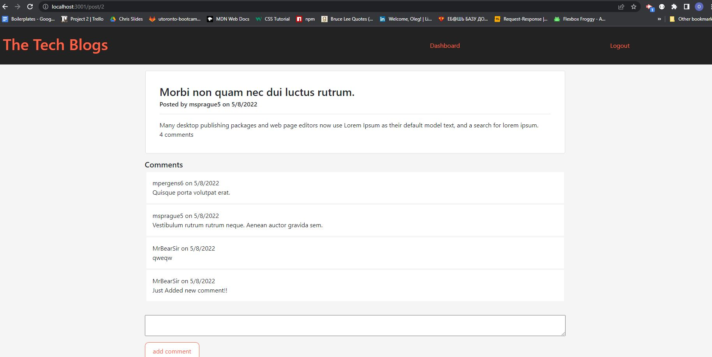
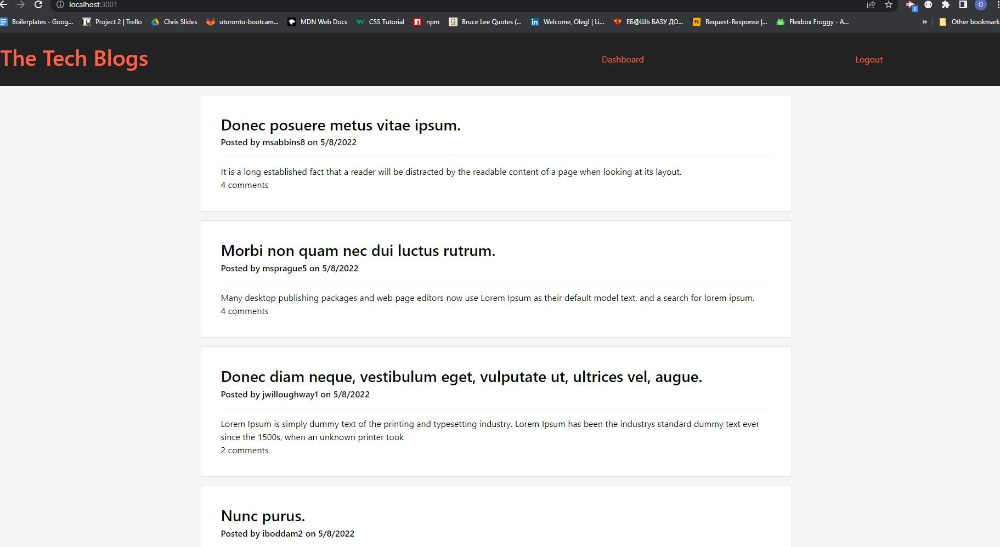

<h># TechBlog</h>
# Student Id.
# Oleg Dobrovolskyi

# Repository Link
https://github.com/MrBearSir/TechBlog.git

# Live Link
https://tech-blog-by-oleg.herokuapp.com/

# Project type.
Model-View-Controller (MVC) Challenge

# User Story.
As a developer who writes about tech
I WANT a CMS-style blog site
SO THAT I can publish articles, blog posts, and my thoughts and opinions

# Skills used in development.
<ul>
<li>Use of MySql database.</li>
<li>Express and sequelize packages.</li>
<li>Use of handlebars module. </li>
<li>Implementing MVC paradigm structure. </li>
<li>Deploying app thru the heroku .</li>
</ul>